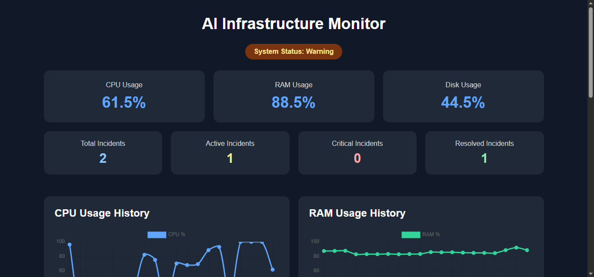

# AI Infrastructure Monitor

An AI-powered infrastructure monitoring dashboard built with Python, Flask, psutil, SQLite, and NVIDIA Nemotron.

## Features

- Live CPU, RAM, and disk monitoring
- Top process monitoring
- Warning and Critical threshold detection
- NVIDIA Nemotron AI incident analysis
- AI reasoning output disabled for concise operational responses
- Incident lifecycle tracking: OPEN → RESOLVED
- SQLite persistence for incident history
- Incident counters: Total, Active, Critical, Resolved
- Incident detail view
- CPU and RAM usage charts
- Automatic dashboard refresh

## Tech Stack

- Python
- Flask
- psutil
- SQLite
- OpenAI Python SDK
- NVIDIA NIM / Nemotron API
- Chart.js

## Project Structure

```text
AI-Infrastructure-Monitor/
├── app.py
├── requirements.txt
├── README.md
├── .gitignore
└── incidents.db        # local database; not committed to Git
```

## Setup

### 1. Create a virtual environment

```powershell
python -m venv .venv
```

### 2. Activate it

```powershell
.\.venv\Scripts\Activate.ps1
```

### 3. Install dependencies

```powershell
pip install -r requirements.txt
```

### 4. Set the NVIDIA API key

PowerShell:

```powershell
$env:NVIDIA_API_KEY="YOUR_NVIDIA_API_KEY"
```

Never commit the API key to GitHub.

### 5. Run

```powershell
python app.py
```

Open:

```text
http://127.0.0.1:5000
```

## How It Works

```text
System Metrics
      ↓
Threshold Detection
      ↓
Normal / Warning / Critical
      ↓
NVIDIA AI Analysis
      ↓
Incident Created
      ↓
SQLite Storage
      ↓
Recovery Detected
      ↓
Incident Resolved
```

## Resume Description

**AI Infrastructure Monitor** — Built a Python/Flask monitoring dashboard using psutil and NVIDIA Nemotron to detect CPU, RAM, and disk anomalies, generate AI-assisted incident analysis, track OPEN/RESOLVED incidents in SQLite, and visualize live resource usage with charts.

## Future Improvements

- Authentication and role-based access
- Email/Slack alerts
- Historical analytics
- Multi-server monitoring
- Docker deployment
- Production WSGI deployment
## Dashboard Preview


